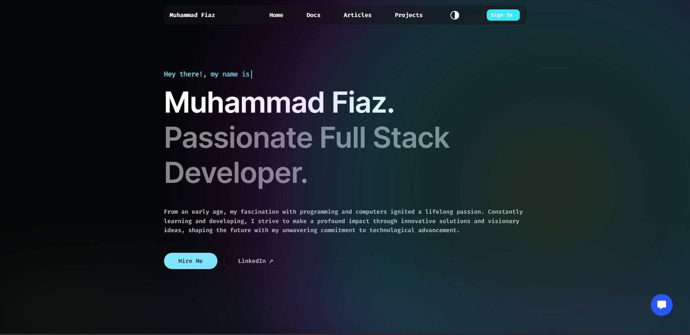

# [muhammadfiaz.com](https://muhammadfiaz.com/)

This project is built with Next.js and React, showcasing [Muhammad Fiaz](https://github.com/muhammad-fiaz/)'s personal website.

**Note: This project is currently under Active development. so the Documentation for this project is not ready yet if available it will be notified in a repository.**

**This Project Also Supports [Vercel](https://vercel.com/dashboard) and comes with [(Vercel Analytics pre-enabled in it)](https://vercel.com/analytics) you can Host it there if you like it**

🧑‍💻 Check out the dev branch for new development changes and the Lastest Patch updates:- [https://github.com/muhammad-fiaz/muhammadfiaz.com/tree/dev](https://github.com/muhammad-fiaz/muhammadfiaz.com/tree/dev)
                                                   

✅ Also Check out the latest release version for production use:-
[https://github.com/muhammad-fiaz/muhammadfiaz.com](https://github.com/muhammad-fiaz/muhammadfiaz.com)

if you have any suggestions or feedback, feel free to open an [issue](https://github.com/muhammad-fiaz/muhammadfiaz.com/issues) or a [pull request](https://github.com/muhammad-fiaz/muhammadfiaz.com/pulls).

## Getting Started

To run the project locally, follow these steps:

1. Clone the repository: `git clone https://github.com/muhammad-fiaz/muhammadfiaz.com.git`
2. Navigate to the project directory: `cd muhammadfiaz.com`
3. Install the dependencies: `npm install`
4. Start the development server: `npm run dev`
5. Open [http://localhost:3000](http://localhost:3000) in your browser to view the website.

## Available Scripts

In the project directory, you can run the following scripts:

### `npm run dev`

Runs the app in development mode.\
Open [http://localhost:3000](http://localhost:3000) to view it in the browser.\
The page will reload if you make edits.\
You will also see any lint errors in the console.

### `npm run build`

Builds the app for production to the `.next` folder.\
It correctly bundles Next.js and optimizes the build for the best performance.

### `next export`

Exports the app to static HTML, which can be run without a Node.js server.\
The exported app will be in the `out` folder.

## Icons Information

💖 Icons are from [Font Awesome](https://fontawesome.com/), [Devicon](https://devicon.dev/),
and also [Google Fonts](https://fonts.google.com/icons).

## More Information

Please Read the [Next.js Documentation](https://nextjs.org/docs/getting-started).
Also, Read the [React.js Documentation](https://reactjs.org/docs/getting-started.html).

## Support Me

Enjoying my work? Consider supporting me by buying me a cup of coffee or becoming a patron.

## License

This project is licensed under the MIT License. See the [LICENSE](https://github.com/muhammad-fiaz/muhammadfiaz.com/blob/main/LICENSE.md) file for details.

## Deploy on Vercel

The easiest way to deploy your Next.js app is to use the [Vercel Platform](https://vercel.com/new?utm_medium=default-template&filter=next.js&utm_source=create-next-app&utm_campaign=create-next-app-readme) from the creators of Next.js.

Check out our [Next.js deployment documentation](https://nextjs.org/docs/deployment) for more details.
                                                                                                     
                                                                                                     
                                                                                                     
